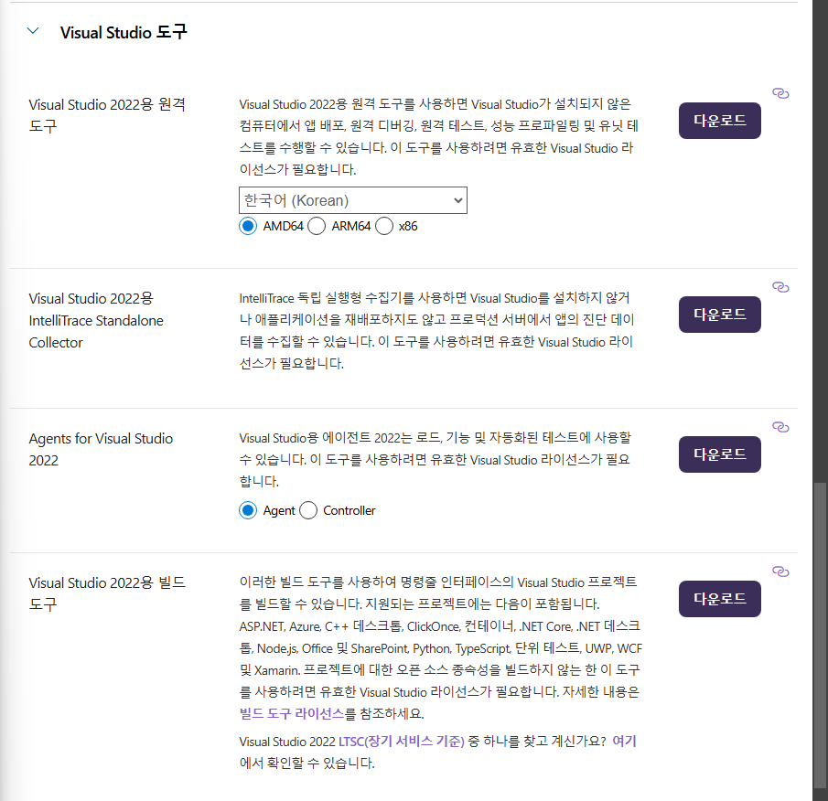
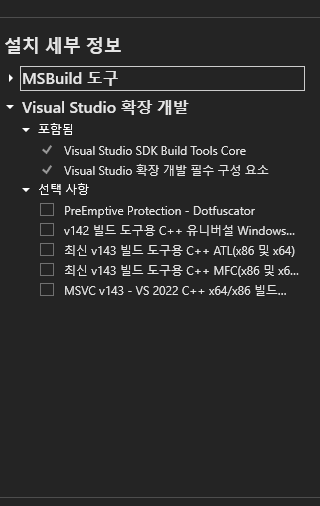

# 한국어 형태소 분석 파이프라인 구축기_01 (feat. `Mecab`)

<br/>

요즘 hot(?)하다고 어디서 주워들은 NLP(National Language Processing), 찍먹이라도 해보려고 `Mecab`을 설치해봤다

<br/>

일단, SSAFY에서 windows 운영체제를 사용하고 있기 때문에, windows 기준으로 오늘 해본 것을 나열하려 한다 (Mac OS는 집에서 도전해보고 추후에 작성하도록 하겠다)

<br/>

일단 설치부터 해 보자

<br/>

## STEP 1 / Visual Studio Build Tools 설치
- Visual Studio 웹사이트에서 "Build Tools for Visual Studio" 다운로드
- C++ 빌드 도구 선택해서 설치

<br/>

[설치 링크](https://visualstudio.microsoft.com/ko/downloads/)

<br/>

일단, 링크에 접속해 스크롤을 아래로 내린다

<Visual Studio 도구>에 들어간다

<br/>



여기서 'Visual Studio 2022용 빌드 도구'를 다운로드 한다

<br/>



<br/>

일단 저 '선택 사항'의 체크박스 5개를 모두 체크한다

<br/>

## Step 2 / `Mecab-ko`, `konlpy` 설치 및 `Python` 바인딩 설치
 
<br/>

```bash
pip install python-mecab-ko
pip install mecab-python3
pip install konlpy
```

<br/>

그리고 한 번 테스트 하고 싶어서

```python
from konlpy.tag import Mecab

mecab = Mecab()
text = "메캅 테스트 문장입니다."
print(mecab.pos(text))
```

<br/>

근데 ~~이따위로~~ 에러가 났다

<br/>

```bash
NameError: name 'Tagger' is not defined
During handling of the above exception, another exception occurred:
Traceback (most recent call last):
  File "c:\Users\SSAFY\Desktop\ko_lang\test_mecab.py", line 3, in <module>
    mecab = Mecab()
```

<br/>

어째서?

`konlpy`가 `Mecab`을 인식하지 못하는 상황이 벌어졌다

그래서

`C:\mecab` 폴더를 만들었다

[Windows MSVC Download Link](https://github.com/Pusnow/mecab-ko-msvc/releases/download/release-0.9.2-msvc-3/mecab-ko-msvc-x64.zip)

압축을 `C:\mecab` 안에 풀어준다

[Download dic file](https://github.com/Pusnow/mecab-ko-dic-msvc/releases/download/mecab-ko-dic-2.1.1-20180720-msvc/mecab-ko-dic-msvc.zip)

이것도 다운로드 후 압축을 `C:\mecab` 안에 풀어준다

<br/>

## Step 3 / Test

<br/>

이제 테스트를 해 볼 시간이다

```python
from konlpy.tag import Mecab

mecab = Mecab(dicpath='C:/mecab/mecab-ko-dic')

text = "메캅 테스트 문장입니다."
print(mecab.pos(text))
```
<br/>

다행히도 Test에 성공했다

```bash
[('메', 'NNP'), ('캅', 'NNP'), ('테스트', 'NNG'), ('문장', 'NNG'), ('입니다', 'VCP+EF'), ('.', 'SF')]
```

<br/>

여기 나오는 `NNP`, `NNG` 등 이상한 알파벳들의 조합이 궁금하다면?

### [mecab-ko-dic 품사 태그 설명](https://docs.google.com/spreadsheets/d/1-9blXKjtjeKZqsf4NzHeYJCrr49-nXeRF6D80udfcwY/edit?gid=589544265#gid=589544265)

이 문서를 참고하도록 하자.


