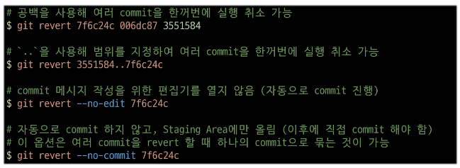

# SSAFY START CAMP 0117

<br/>

## `gitignore` -> 커밋할 때 포함되지 않는다

<br/>

특정 파일이나 디렉토리를 추적하지 않도록 설정하는 데 사용되는 텍스트 파일

예: 회원가입한 사용자 정보를 online상에 올리면 개인정보가 유출될 수 있기 때문이다

gitignore 파일 생성할 때 앞에 . 붙여야 함, 그리고 확장자가 없음 `.gitignore`

<br/>

### gitignore의 주의점
- 버전관리 받은 이력이 있는 파일은 `gitignore` 적용해도 먹히지 않음
- `gitignore`은 개발 첫 세팅 때 써야 한다는 것
- (나중에 `git rm —cached` 명령어를 통해 git 캐시에서 삭제하면 되긴 하는데 다들 별로 안 하고 싶어함)

<br/>

#

<br/>


``` bash
SSAFY@2□□089 MINGW64 ~/Desktop/gitignore
$ git init
Initialized empty Git repository in C:/Users/SSAFY/Desktop/gitignore/.git/

SSAFY@2□□089 MINGW64 ~/Desktop/gitignore (master)
$ touch a.txt b.txt

SSAFY@2□□089 MINGW64 ~/Desktop/gitignore (master)
$ ls
a.txt  b.txt

SSAFY@2□□089 MINGW64 ~/Desktop/gitignore (master)
$ git status
On branch master

No commits yet

Untracked files:
  (use "git add <file>..." to include in what will be committed)
        a.txt
        b.txt

nothing added to commit but untracked files present (use "git add" to track)
```
``` bash
SSAFY@2□□089 MINGW64 ~/Desktop/gitignore (master)
$ touch .gitignore
SSAFY@2□□089 MINGW64 ~/Desktop/gitignore (master)
$ git status
On branch master

No commits yet

Untracked files:
  (use "git add <file>..." to include in what will be committed)
        .gitignore
        b.txt

nothing added to commit but untracked files present (use "git add" to track)
```
[gitignore 만들어주는 곳](https://www.toptal.com/developers/gitignore)

<br/>


## `GitHub`의 활용 영역
- 개발자의 포트폴리오
  - 프로젝트, 공부 내역을 올리다 보면 '나를 소개하는 하나의 자료'로 사용할 수 있다
  - 개발자 지원란에 github 주소를 내라고 하는 경우가 많다는 것
- 프로젝트 협업

<br/>

### github으로 포트폴리오를 쓰려면?
- TIL Today I Learned -> 학습하는 것을 기록
- 코드 작성 스타일
  - 어떤 코드를 작성했는지 공유하고 평가받기 위함
- 오픈 소스 프로젝트에 기여

<br/>

### TIL 이란?
- 매일 내가 배운 것을 마크다운으로 정리해서 문서화하는 것
- ***단순히 배운 것만을 필기하는 것이 아닌, 스스로 더 나아가 어떤 학습을 했는지를 기록하는 것 (중요)***
- 미래의 나를 위해서도 중요하지만, ‘문서화’라는 능력을 가지게 됨
- 이 ‘문서화’는 신입 개발자에게 가장 중요한 요구사항이다
- 배운 것을 글로 표현할 수 있다 → 스스로 배워서 성장할 수 있다
- 네이버에서 요구하는 개발자의 역량 - 2번부터
- [백엔드 개발자를 꿈꾸는 학생개발자들에게](https://d2.naver.com/news/3435170)

<br/>

### TIL 만들기
- TIL이라는 이름의 레포지토리 생성
- 로컬 저장소 생성
- [README.md](http://README.md) 생성 및 지금까지의 수업 내용을 정리하고 commit을 생성
- TIL 원격 저장소를 추가
- commit 목록을 push
- ‘보기 좋은 개발자 TIL’ 구글링해서 참고하자

<br/>

``` bash
SSAFY@2□□089 MINGW64 ~/Desktop
$ git clone https://github.com/meowdevhyerin/TIL
Cloning into 'TIL'...
remote: Enumerating objects: 3, done.
remote: Counting objects: 100% (3/3), done.
remote: Total 3 (delta 0), reused 0 (delta 0), pack-reused 0 (from 0)
Receiving objects: 100% (3/3), done.

SSAFY@2□□089 MINGW64 ~/Desktop
$
```
내 github에 클론하기

<br/>

### github 프로필 꾸미기

1. 본인의 Github username으로 Github Repository를 생성
2. [README.md](http://README.md) 파일을 생성하고, 해당 파일에 자유롭게 자기소개를 작성
3. commit 생성, remote 및 push

### [README.md](http://README.md) 파일이란?

- 프로젝트에 대한 설명, 사용 방법, 문서화된 정보 등을 포함
- 마크다운 형식
- 저장소 최상단에 위치해야 원격 저장소에서 올바르게 출력됨

### git revert

- 특정 commit을 없었던 일로 만드는 작업
- 변경 사항을 안전하게 실행 취소할 수 있도록 도와주는 순방향 실행 취소 작업
- git에서 기록이 손실되는 것을 방지하며, 기록의 무결성과 협업의 신뢰성을 높인다

``` bash
git revert <commit id>
```

이렇게 해야 함

*커밋 메시지 말고, 커밋의 아이디를 사용해야 한다는 점 명심!*

<br/>

### git revert의 작동 원리

- ‘재설정’
- 단일 commit을 실행 취소하는 것
- 프로젝트 기록에서 commit을 없었던 일로 처리 후, 그 결과를 새로운 commit으로 추가
- 왜 커밋의 개수를 유지시키는 것인가?
    - 커밋은 앞 커밋에 종속되어 있다 → 따라서, 중간 단계가 빠질 수 없다 (유기적 관계를 이해할 것)
    - 결국 git을 최종적으로 쓰는 이유는: 협업!
        - 하나가 지워져버리면, 다른 팀원들과 충돌

<br/>

### vim

- 입력모드와 명령모드가 있다 (공간이 두 개라고 생각하면 편하다)
- ‘insert’는 입력모드
- esc 누르면 명령모드가 된다
- : 누르고 명령할 수 있다
- w와 q만 기억해도 됨 (w는 write, q는 quit)   

<br/>

*revert 할 때 vim이 왜 켜졌는가?*
- commit 할 때 메시지를 넣음
- revert 하고 커밋할 때는 메시지 입력을 못 함
- 근데 기본적으로 커밋 메시지를 주긴 함   



<br/>


### git reset
- 조금 위험한 작업, 쓸 일이 별로 없을 것이다
- git revert는 새로운 미래를 만드는 것, 하지만 reset은 말 그대로 ‘시간여행’, ‘완전히 과거로 돌아가는 것’이라고 볼 수 있다
- 특정 과거 시점으로 돌아가, 시점 이후 일들을 무효화 함
    - 특정 commit으로 되돌아갔을 때, 되돌아간 commit 이후의 commit은 모두 삭제

``` bash
git reset [옵션] <commit id>
```

<br/>

### `git reset`의 3가지 옵션
- 삭제되는 commit들의 기록을 어떤 영역에 남겨둘 것인지 옵션을 활용해 조정할 수 있음

<br/>

1. `--soft`
   - 삭제된 commit의 기록을 Staging Area에 남김
   - add가 된 상태로 남긴다

2. `--mixed`
    - 옵션을 안 쓰면 자동으로 mixed가 됨
    - 삭제된 commit의 기록을 working directory에 남김
    - add가 되지 않은 상태

3. `--hard`
    - 삭제된 commit의 기록을 남기지 않음
    - ~~제일 무서운 놈~~
    - 거의 쓸 일이 없다고 한다 왜? ~~ㅈㄴ위험해서~~

#### *즉, "commit은 삭제하지만 내 친히 남길 수 있는 기회는 주겠다"는 뜻임*

<br/>

<br/>

#

<br/>
그럼, 이미 삭제한 commit으로 다시 돌아가고 싶다면?

## `git reflog`
- reset의 `--hard` 옵션을 통해 지워진 commit도 `reflog`로 조회하여 복구할 수 있다


<br/>
<br/>
<br/>

*5252 나도 이제 git 쓸 수 있다구*
