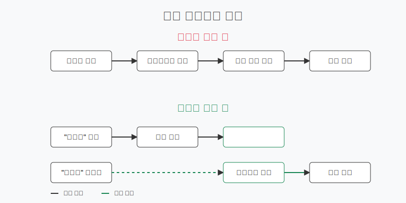

# Chatbot Program with ChatGPT

<br/>

``` js
// 채팅 전송 및 수신을 위한 선택
const chatInput = document.querySelector('.chat-input')
const chatContainer = document.querySelector('.chat-area')

// 채팅창에 내용을 추가해주는 부분
const addChat = (type, value) => {
  const chat = document.createElement('div')
  chat.classList.add('chat')
  chat.innerText = value
  chat.classList.add(`${type}-chat`)
  chatContainer.appendChild(chat)
  chatContainer.scrollTop = chatContainer.scrollHeight
}

// 1. 챗봇 서버에 요청할 URL (chatGPT API reference Chat 파트 참고)
const OPEN_API_URL = 'https://api.openai.com/v1/chat/completions'
// 2. API 키 (발급 받은 Secret Key)
const API_KEY = '여기서 Secret key 입력'

// 필요한 헤더 정보
const headers = {
  Authorization: `Bearer ${API_KEY}`, // 인증 키 설정
  'Content-Type': 'application/json' // 요청 데이터의 타입
}

// 이전에 응답받은 메세지를 저장하는 변수
let oldMsg = ''

const chatReceive = (userMsg) => {
  // 사용자가 입력한 내용은 content 에 작성하여 API 서버에 전달
  const messages = [
    // 사용자가 작성한 내용에 대한 부분
    {
      role: 'user',
      content: userMsg
    },
    // 이전에 응답한 내용을 아래와 같이 넣어주지 않으면 채팅 맥락이 연결되지 않음
    // 1. 이전 정보를 메세지에 추가
    {
      'role': 'system',
      'content': oldMsg
    }
  ]

  // chatGPT API 서버에 요청을 보내는 부분
  axios({
    // 요청에 대한 설정 부분
    method: 'post', // POST 요청
    url: OPEN_API_URL, // 요청하는 URL
    headers, // 인증 데이터 설정
    data: { // 요청 데이터 설정
      model: 'gpt-4o-mini', // gpt 모델 정보 설정
      messages, // 사용자가 입력한 내용을 담은 메세지 설정
      temperature: 0.7,
      max_tokens: 1000
    }
  })
  //  chatGPT API 서버에서 정상적으로 응답이 도달했을 때 실행되는 부분
    .then(res => {
    // 응답 데이터 확인 (크롬 개발자 도구 콘솔창)
      console.log(res.data)

      // 1. 응답 데이터에서 응답 메세지를 가져온다.
      const response = res.data.choices[0].message.content
      console.log(response)

      // 2. 채팅창에 메세지를 등록한다.
      addChat("receive", response)

      // 3. 채팅의 연속성을 위해 이전 메세지를 oldMsg 변수에 저장
      // messages 에서 system 메세지의 content 값으로 설정됨

      oldMsg = response

    })
    // 요청에 있어 잘못된 설정이나 서버에 문제가 있을 때 실행되는 부분
    .catch(err => {
      console.log(err.response.data) // 에러 데이터
      console.log(err.response.status) // 4xx : 사용자 실수, 5xx : 서버 문제
    })
}

const chatSubmit = () => {
  const value = chatInput.value
  if (!value) return
  addChat('send', value)
  chatReceive(value)
  chatInput.value = ''
}

chatInput.addEventListener('keyup', (e) => {
  e.key === 'Enter' && chatSubmit()
})

```

### [>ChatGPT API documents<](https://platform.openai.com/docs/api-reference/making-requests)

<br/>

<br/>
<br/>

하지만 GPT 유료모델을 쓰지 않아서

``` js

error
: 
code
: 
"insufficient_quota"
message
: 
"You exceeded your current quota, please check your plan and billing details. For more information on this error, read the docs: https://platform.openai.com/docs/guides/error-codes/api-errors."
param
: 
null
type
: 
"insufficient_quota"

```
이런 에러메시지가 떴다 (유감)

<br/>
<br/>

하지만 우리의 ~~자비로운~~ 싸피는 API 키를 ***잠시*** 대여해줬다

``` js
console.log(res.data)
```
이게 프린트라고 한다 ~~(솔직히 지금까지는 잘 모르겠다)~~
<br/>
콘솔 로그라고 한다
-> 파이썬의 `print`와 같은 개념이라고 이해하자

<br/>

```js
 .then(res => {
    // 응답 데이터 확인 (크롬 개발자 도구 콘솔창)
      console.log(res.data)

      // 1. 응답 데이터에서 응답 메세지를 가져온다.
      const response = res.data.choices[0].message.content
      console.log(response)

      // 2. 채팅창에 메세지를 등록한다.
      addChat("receive", response)

      // 3. 채팅의 연속성을 위해 이전 메세지를 oldMsg 변수에 저장
      // messages 에서 system 메세지의 content 값으로 설정됨

      oldMsg = response

```

여기서 `oldMsg`는 const가 아니라 `let`을 써야 한다는 점 명심하기

~~사실 나는 아직 아무것도 모른다~~

<br/>

언젠가 js를 마스터할 날이 올까...?


<br/>

## ~~드디어~~ `Python`으로 GPT API 실습해보기


<br/>

API 주요 파라미터
- model: 사용하고자 하는 모델
- messages: role과 content 부여하여 응답의 다양성을 제어
- n: How many chat completion choices to generate for each input message
  - Integer, Optional, Defaults to 1
  - n을 너무 크게 설정하면 과비용 발생 (주의의)
- top_p: top_p probability mass를 가진 token의 결과를 고려하여 선택
  - 0 ~ 1 사이의 값을 가짐, 1에 가까울수록 다양한 token 고려
- temperature: degree of diversity를 나타냄
  - 0 ~ 2 사이의 값
  - 기본값: 1
  - 높을수록 다양한 문장

<br/>

### More information about Parameter Details: [click here](https://platform.openai.com/docs/advanced-usage#parameter-details)

<br/>

하지만, OpenAI document에는 temperature와 top_p **조정하지 말 것을** 추천한다


### *"We generally recomment altering this or `temperature` but not both."*

<br/>

일단 시작해보자

```python
# 필요 라이브러리 설치
!pip install openai

#API-KEY 설정
OPENAI_API_KEY = "OPENAI_API_KEY"
```


```python
from openai import OpenAI
client = OpenAI(api_key=OPENAI_API_KEY)

# 페르소나 지정 및 기존 대화 내용 저장
conversation_history = [
    {"role": "system", "content": "당신은 사용자 질문에 답변하는 챗봇입니다."},
    {"role": "system", "content": "답변은 사용자가 읽기 쉽도록 마크다운 형태로 정리해서 출력해줘."},
]
# 질문
conversation_history.append(
    {
        "role": "user",
        "content": "오늘 달달하고 매콤한 것을 먹고 싶은데, 점심 메뉴 추천해줄래?",
    }
)

# API 호출
response = client.chat.completions.create(
    model="gpt-4o-mini",  # 사용하려는 모델 (필수 지정)
    messages=conversation_history,  # 대화 메시지 목록 (필수 지정)
    max_tokens=500,  # 생성될 응답의 최대 토큰 수 (값의 범위: 1~모델 마다 최대값 ex> gpt-4o-mini: 16,385 tokens)
    temperature=1.0,  # 확률 분포 조정을 통한 응답의 다양성 제어 (값의 범위: 0~2)
    top_p=1.0,  # 누적 확률 값을 통한 응답의 다양성 제어 (값의 범위: 0~1)
    n=1,  # 생성할 응답 수 (1이상의 값)
    seed=1000 # 랜덤 씨드 값
)
# 응답 출력
for response in response.choices :
  print(f"Assistant: {response.message.content}")
```


<br/>

## 한국어 위키피디아 검색 챗봇 만들기

<br/>

### 1. 기본 설정 및 모델 초기화

```python
chat = ChatOllama(
    temperature=0.6,
    model="llama3.2",
    system_prompt="모든 질문에 정중하게 한국어로 대답하세요."
)
```

- ChatOllama 인스턴스를 생성하여 LLM(Large Language Model) 설정
- temperature 0.6으로 설정하여 적당한 창의성 부여
- 시스템 프롬프트로 한국어 응답 지시

<br/>

### 2. 위키피디아 검색 도구 설정

```python
retriever = WikipediaRetriever(
    lang="ko",
    doc_content_chars_max=500,
    top_k_results=2
)

wikipedia_tool = create_retriever_tool(
    name="WikipediaSearch",
    description="위키피디아에서 정보를 검색할 때 사용하는 도구입니다.",
    retriever=retriever
)
```

- 한국어(ko) 위키피디아 검색을 위한 retriever 설정
- 검색 결과 최대 500자로 제한
- 상위 2개 결과만 반환
- retriever를 이용해 위키피디아 검색 도구 생성

<br/>

### 3. 대화 기억 및 에이전트 설정


```python
memory = ConversationBufferMemory(
    memory_key="chat_history",
    return_messages=True
)

agent = initialize_agent(
    tools=[wikipedia_tool],
    llm=chat,
    agent=AgentType.CHAT_CONVERSATIONAL_REACT_DESCRIPTION,
    memory=memory,
    verbose=True
)
```
- 대화 내역을 저장할 메모리 버퍼 생성
- 위키피디아 검색 도구, LLM, 메모리를 포함한 대화형 에이전트 초기화
- CHAT_CONVERSATIONAL_REACT_DESCRIPTION 타입으로 대화형 에이전트 설정

<br/>

### 4. Chainlit 이벤트 핸들러

```python
@cl.on_chat_start
async def on_chat_start():
    cl.user_session.set("agent", agent)
    await cl.Message(content="안녕하세요!!").send()

@cl.on_message
async def on_message(message: cl.Message):
    agent = cl.user_session.get("agent")
    try:
        result = await cl.make_async(agent.invoke)(
            message.content,
            callbacks=[cl.LangchainCallbackHandler()]
        )
        if result and "output" in result:
            await cl.Message(content=result["output"]).send()
        else:
            await cl.Message(content="검색 결과를 찾을 수 없습니다.").send()
    except Exception as e:
        await cl.Message(content=f"오류가 발생했습니다: {str(e)}").send()
```
- 채팅 시작 시 에이전트를 세션에 저장하고 환영 메시지 전송
- 사용자 메시지 수신 시 에이전트를 통해 위키피디아 검색 수행
- 비동기 처리로 검색 결과 반환
- 에러 처리 및 결과 없을 경우 대체 메시지 전송

### 주요 특징
- 한국어 지원: 위키피디아 검색과 응답이 모두 한국어로 제공
- 대화 기억: ConversationBufferMemory로 이전 대화 내용 유지
- 비동기 처리: Chainlit의 Asynchronous event handling으로 효율적인 처리
- 에러 처리: 검색 실패나 기타 오류에 대한 예외 처리 구현

### 코드 개선 방안
- Ollama 모델 성능에 크게 의존
- wikipedia 서버 응답 속도에 영향을 받음
- 개선안: caching mechanism 도입

<br/>

### What is Caching Mechanism?
- 자주 사용하는 데이터를 임시로 저장해두고 재사용하는 방식
- 작동 원리
  - 처음 데이터를 요청할 때 -> 결과를 캐시(임시저장소)에 저장
  - 같은 데이터를 다시 요청할 때 -> 원본 소스가 아닌 캐시에서 가져옴

<br/>

### 구체적인 챗봇 코드에서의 예시



<br/>

## Caching Mechanism의 장단점
- ### 장점
  - 응답 속도가 빨라짐
  - 서버 부하 감소
  - 네트워크 사용량 감소

- ### 단점
  - 메모리 사용량 증가
  - 오래된 정보를 보여줄 수 있음


